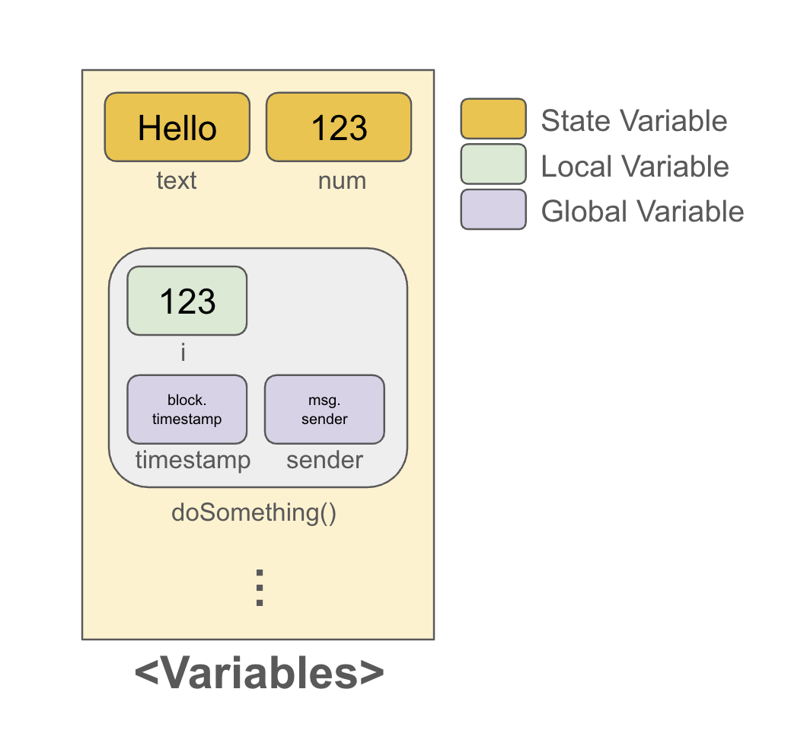

# Variable

Solidity에서 변수는 크게 세 가지 종류로 나뉜다

- **Local Variable**
- **State Variable**
- **Global Variable**

각각의 변수는 저장 위치와 수명, 가스 비용이 다르며, 사용하는 맥락도 다르다

---

## Local Variable

`Local Variable`은 **함수 내부에서만 사용되는 변수**다

### 특징

- **일시적 저장** : 함수 실행 중에만 메모리에 존재하고, 함수가 끝나면 사라진다
- **블록체인에 기록되지 않음** : 영구 저장되지 않으므로 상태(State)에 영향을 주지 않는다
- **가스 비용 절약** : 블록체인에 쓰이지 않으므로 상대적으로 저렴하다
- **접근 제한** : 선언된 함수 내부에서만 접근할 수 있으며 다른 함수에서는 접근 불가하다

### 예시

```solidity
function calculate(uint x, uint y) public pure returns (uint) {
    uint result = x + y; // Local variable
    return result;
}
```

---

## State Variable

`State Variable`은 **계약(Contract)의 상태를 저장하는 변수**다

### 특징

- **영구 저장** : 블록체인에 저장되며, 트랜잭션이 끝난 뒤에도 값이 유지된다
- **가스 비용 발생** : 쓰기(Write) 시 많은 가스를 소모한다 (읽기는 무료)
- **공유 가능** : 같은 계약의 모든 함수에서 접근 가능하다
- **자동 getter** : `public`으로 선언하면 자동으로 읽기 전용 getter 함수가 생성된다

### 예시

```solidity
contract Example {
    uint256 public count = 0; // State Variable

    function increment() public {
        count += 1; // 블록체인 상태 변경, 가스 비용 발생
    }

    function getCount() public view returns (uint256) {
        return count; // 읽기만 하는 함수는 가스가 들지 않음
    }
}
```

---

## Global Variable

`Global Variable`은 Solidity가 **미리 정의해 둔 특수 변수**다

컨트랙트, 트랜잭션, 블록에 관한 정보를 제공한다

### 주요 예시

- **Block 관련**
    - `block.number (uint)` : 현재 블록 번호
    - `block.timestamp (uint)` : 현재 블록의 타임스탬프(Unix 시간, 초 단위)
    - `block.coinbase (address)` : 채굴자 주소
    - `block.difficulty (uint)` : 블록 난이도
    - `block.gaslimit (uint)` : 블록 가스 한도
- **Message 관련**
    - `msg.sender (address)` : 함수 호출자 주소
    - `msg.value (uint)` : 전송된 이더의 양 (wei 단위)
    - `msg.data (bytes)` : 호출 시 전달된 데이터 전체
    - `msg.sig (bytes4)` : 호출된 함수의 selector(첫 4바이트)
- **Transaction 관련**
    - `tx.origin (address)` : 트랜잭션을 처음 발생시킨 외부 계정 주소
    - `tx.gasprice (uint)` : 트랜잭션에 지정된 가스 가격

### 예시

```solidity
function getBlockInfo() public view returns (uint, uint) {
    return (block.number, block.timestamp);
}

function getSenderInfo() public payable returns (address, uint) {
    return (msg.sender, msg.value);
}
```

---

## 예제 전체 코드

```solidity
// SPDX-License-Identifier: MIT
pragma solidity ^0.8.24;

contract Variables {
    // State Variable: 블록체인에 영구 저장
    string public text = "Hello";
    uint256 public num = 123;

    function doSomething() public {
        // Local Variable: 함수 내 일시적 저장
        uint256 i = 456;

        // Global Variable: 블록, 트랜잭션 정보 활용
        uint256 timestamp = block.timestamp; // 현재 블록 타임스탬프
        address sender = msg.sender;         // 호출자 주소

        // 단순 예시: 읽기만 하므로 상태 변경 없음
        i + timestamp + uint160(sender);
    }

    // State Variable 쓰기
    function setNum(uint256 _num) public {
        num = _num; // 블록체인에 저장, 가스 발생
    }

    // State Variable 읽기
    function getNum() public view returns (uint256) {
        return num; // 읽기는 가스 소모 없음 (외부 호출 시)
    }

    // Global Variable 활용
    function getBlockInfo() public view returns (uint256, uint256) {
        return (block.number, block.timestamp);
    }
}
```



* `public`으로 선언된 상태변수 `text`와 `num`은 자동으로 읽기 전용 getter() 함수가 생긴다. 
* `doSomething` 함수는 Local Variable과 Global Variable을 사용하지만, 블록체인의 상태를 변경하진 않기 때문에 (=State Variable를 변경하지 않기 때문에)  실행 결과를 따로 확인할 수는 없다.
*  `setNum` 함수: `num` 상태 변수를 변경하는 함수
* `getNum` 함수: `num` 상태 변수를 조회하는 함수
* `getBlockInfo` 함수: 현재 블록 번호와 타임스탬프를 반환하는 함수

---

## 요약

- Local Variable → **함수 실행 중 임시 값**
- State Variable → **블록체인에 저장되는 계약의 상태 값 (쓰기 시 가스 비용 발생)**
- Global Variable → **Solidity에서 제공하는 환경 정보 (블록, 트랜잭션, 메시지)**


